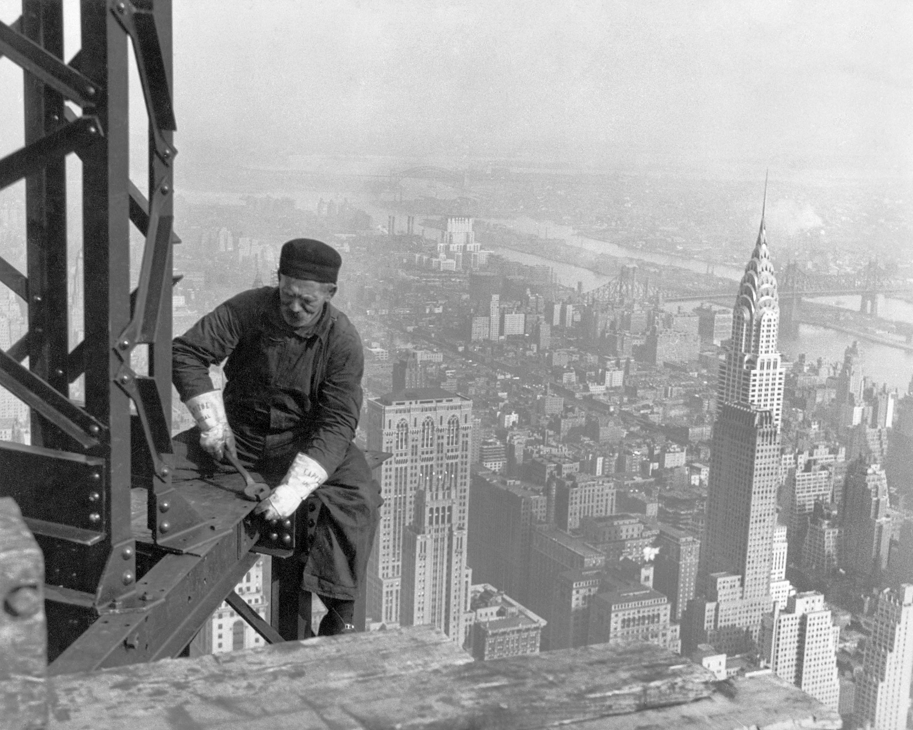

```{r setup, include=FALSE}
knitr::opts_chunk$set(echo = TRUE)
```


```{r, echo=FALSE}
# Use this Rmarkdown to reproduce a report on how skyscrapers' material, floors, and height influence its stability. 
```

## 1. Introduction: 
#####  Click [HERE](https://drive.google.com/file/d/1HKT_hSw2cBKA-EgxtnwcYPI5bdF60PE2/view?usp=sharing) to view the dataset (If it says 'forbidden', then try the 'Open in Browser' option instead.)
We choose the data set of skyscrapers. The above dataset records 1275 skyscrapers’ name, city, material, number of floors, height, current status(either demolished or completed), completed year, start year, years to build. The data is collected by CTBUH(Council on Tall Buildings and Urban habitat) experts by conducting scientific measurements and keeping track of historical records. In order to design sustainable skyscrapers during construction, many factors must be considered holistically to make sure those buildings can support their weight, resist wind, and earthquakes. Therefore, we are going to investigate the influences of a skyscraper's material, number of floors, and height on its current status (either demolished or completed). The chosen outcome is current status (demolished/completed) of the skyscraper. Three potential predictors are: material, number of floors, and height.


```{r, echo=FALSE}
# This is the place to import csv file containing building information. Change the file name inside read.csv('new file.csv'); upload a new picture by include_graphics("picture.jpeg")
skyscrapers <- read.csv('/Users/cindyfan/Desktop/Project 1/skyscrapers.csv')
 

```
Source: Lewis Hine, "Framework of the Empire State Building", Wikipedia, 1 January 1930
[https://en.wikipedia.org/wiki/Skyscraper_design_and_construction#/media/File:Old_timer_structural_worker2.jpg](https://en.wikipedia.org/wiki/Skyscraper_design_and_construction#/media/File:Old_timer_structural_worker2.jpg)


## 2. Distribution of current status (completed/demolished)
```{r, echo=FALSE}
# Here we assign numeric values of characteristics about skyscrapers to variables 'status'.  
status <- skyscrapers$CurrentStatus
table(status)
prop.table(table(status))
demolished <- sum(skyscrapers$CurrentStatus=='demolished')
completed <- sum(skyscrapers$CurrentStatus=='completed')
status <- c(completed, demolished)
barplot(status, main = "Distribution of skyscrapers' current status", 
        xlab = 'status', ylab = 'frequency', ylim=c(0,1400),
        col=c('aquamarine', 'blue'))
legend("topright", c("completed", "demolished"), col=c("aquamarine","blue"), lwd=10);
slices <- c(1251,24)
labels <- c('completed:1251', 'demolished:24')
pie(slices, labels, main="Distribution of 1275 skyscrapers' current status", col=c('aquamarine','blue'))

```


As shown by the table and graphs above, there are 1251 completed buildings(98.12%) and 24 demolished ones(1.88%) out of 1275 skyscrapers. Although the number of demolished skyscrapers are innegligible, majority of those 1275 skyscrapers are completed(not demolished).


## 3. Investigating the relationship between current status and material/number of floors/height

### 3.1 relationship between current status and material

```{r, echo=FALSE}
barplot(prop.table(table(skyscrapers$CurrentStatus, skyscrapers$Material),2),
        main = 'Relationship between current status and material',
        xlab ='Material', ylab = 'Current Status(proportion of demolished/completed)', 
        col=c('rosybrown1','purple'))
 legend("bottomright", c("Completed", "Demolished"), fill = c('rosybrown1','purple'))
 
prop.table(table(skyscrapers$CurrentStatus, skyscrapers$Material),2)
```
From the above graph we observe that: Skyscrapers made from both 'composite' and 'concrete/steel' do not have any demolished ones. Skyscrapers made from 'concrete' has a demolished rate of 0.0028, and Skyscrapers made from 'steel' has a demolished rate of 0.0449, both of which has moderate demolished rate(less than 0.05). Skyscrapers made from 'masonry' has a demolished rate of 0.50, which is severe and significant. Therefore, we can conclude that: 'composite' and 'concrete/steel' are both ideal materials for skyscraper construction; 'concrete' and 'steel' are the next good fit for skyscraper construction but has some kind of risk of being demolished; 'masonry' is a bad material and often leads to damage of skyscrapers and thus should not be used. 


### 3.2 relationship between current status and number of floors


```{r, echo=FALSE}
boxplot(Floors~CurrentStatus, data=skyscrapers, main = 'distribution of number of floors based on different current status', col='darkseagreen1', border='brown', horizontal = TRUE)

demolished <- skyscrapers[skyscrapers$CurrentStatus == 'demolished',]
completed <- skyscrapers[skyscrapers$CurrentStatus == 'completed',]
```


  Five number summary(minimum, quartile 1, median, quartile 3, and maximum) of number of floors of demolished skyscrapers: `r fivenum(demolished$Floors)`. 
Five number summary of number of floors of completed skyscrapers: `r fivenum(completed$Floors)`. According to the above boxplots we find out that demolished skyscrapers have a lower median and narrower range of number of floors compared to the ones of completed skysrapers. Therefore, we can conclude that demolished skyscrapers generally have fewer floors than the completed skyscrapers.


### 3.3 relationship between current status and height 

```{r, echo=FALSE}
boxplot(Height~CurrentStatus, data=skyscrapers, main = 'distribution of number of floors based on different current status', col='paleturquoise1', border='brown', horizontal = TRUE)
```

Five number summary(minimum, quartile 1, median, quartile 3, and maximum) of height of demolished skyscrapers: `r fivenum(demolished$Height)`. Five number summary of height of completed skyscrapers: `r fivenum(completed$Height)`. According to the above boxplots we find out that demolished skyscrapers have a lower median and narrower range of number of floors compared to the ones of completed skysrapers. Therefore, we can conclude that demolished skyscrapers generally have lower heights than the completed skyscrapers.


## 4. Conclusion
Overall, demolished skyscrapers tend to have fewer number of floors and lower heights, and are most likely made from mansory. Therefore, few number of floors, low height, made from mansory could all be predictive factors of a demolished skyscraper. Future research need to be done on how destroyed top floors might affect or damage the bottom floors of demolished skyscrapers, and how to prevent the damage of buildings by planning scientifically. 

### references:
-Austin Cory Bart, 'Skyscrapers CSV File', Council on Tall Buildings and Urban Habitat, 22 March 2016
[https://corgis-edu.github.io/corgis/csv/skyscrapers/](https://corgis-edu.github.io/corgis/csv/skyscrapers/)
    
-Lewis Hine, "Framework of the Empire State Building", Wikipedia, 1 January 1930
[https://en.wikipedia.org/wiki/Skyscraper_design_and_construction#/media/File:Old_timer_structural_worker2.jpg](https://en.wikipedia.org/wiki/Skyscraper_design_and_construction#/media/File:Old_timer_structural_worker2.jpg)


